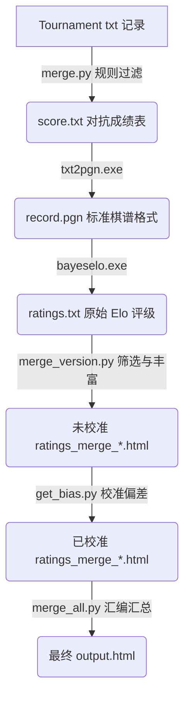
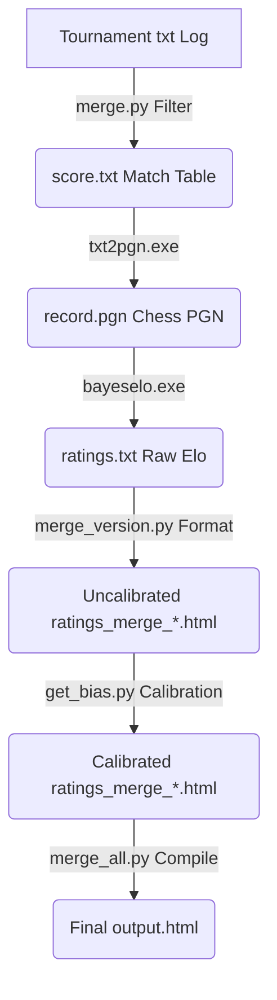

# Gomocup Elo Rating System / Gomocup Elo 评级系统

[English](#english-version) | [中文](#中文版)

---

## 中文版

本系统用于根据 Gomocup（五子棋世锦赛）从 2000 年至今的历史比赛对局结果，计算并生成参赛五子棋 AI 的 Elo 评级。

系统将评级划分为四个独立的评级系统：**Freestyle 评级系统**（包含 Freestyle20、Fastgame、Freestyle15 三个规则）、**Standard 评级系统**、**Renju 评级系统**以及 **Caro 评级系统**。系统基于 **Bayesian Elo** 算法进行概率估算，并利用全局参考库对各规则进行 ELO 偏置校准，最终生成一个结构分明、统一展示的 `output.html` 页面。

---

### 一、 目录与文件结构分析

#### 1. 核心可执行文件与源码
*   [bayeselo.exe](file:///d:/Programming/CPP/Gomocup/Organization/GomocupEloRating/bayeselo.exe): 基于 Remi Coulom 的 Bayesian Elo 系统编译的可执行程序。负责核心的 ELO 概率估算及差值计算。
*   [txt2pgn.exe](file:///d:/Programming/CPP/Gomocup/Organization/GomocupEloRating/txt2pgn.exe) & [txt2pgn.cpp](file:///d:/Programming/CPP/Gomocup/Organization/GomocupEloRating/txt2pgn.cpp): 辅助工具。它读取 `score.txt`（包含对局双方比分数据），并将其转换为标准的棋类 PGN 格式文件 `record.pgn`，以便 `bayeselo.exe` 识别。

#### 2. 数据配置与映射文件
*   [rules.json](file:///d:/Programming/CPP/Gomocup/Organization/GomocupEloRating/rules.json): 规则与后缀映射文件。定义了所有规则、所包含的文件后缀、排版板块层次、最少局数门槛、基准偏置校准值等。修改此文件可直接增减规则或后缀，无需更改程序代码。
*   [author.txt](file:///d:/Programming/CPP/Gomocup/Organization/GomocupEloRating/author.txt): AI 开发者数据库。包含 AI 的原始名称、作者名字、所属国家/地区代码（用于网页匹配国旗，如 `CHN`, `CZE`, `POL`）。
*   [displayname.txt](file:///d:/Programming/CPP/Gomocup/Organization/GomocupEloRating/displayname.txt): 显示名称映射表。用于将原始的或非标准的引擎名称（如 `CARBON HGARDEN2007`）映射为统一标准格式的“引擎名 年份”展示名称（如 `HGARDEN 2007`）。
*   [nickname.txt](file:///d:/Programming/CPP/Gomocup/Organization/GomocupEloRating/nickname.txt): 别名与同义词映射表。用于规范化对局结果中拼写不一致的引擎名称（例如将 `ALPHAGOMOKU.MK20` 映射到主名称 `ALPHAGOMOKUMK` 并提取年份）。
*   [blacklist.txt](file:///d:/Programming/CPP/Gomocup/Organization/GomocupEloRating/blacklist.txt): 黑名单。定义了需要屏蔽的引擎对局记录，防止由于测试失误或违规对局影响 ELO 准确性。格式为：`AI名称\t对局文本名（不含后缀）`。
*   [benchmark.txt](file:///d:/Programming/CPP/Gomocup/Organization/GomocupEloRating/benchmark.txt): 基准评分锚点。指定某些历史稳定版本的 Elo 作为固定基准，用以校准整体偏差。

#### 3. 计算流程控制脚本
*   [start.bat](file:///d:/Programming/CPP/Gomocup/Organization/GomocupEloRating/start.bat): 自动化计算的总控制脚本。现简化为一个调用 `run_pipeline.py` 的入口包装。
*   [compute.bat](file:///d:/Programming/CPP/Gomocup/Organization/GomocupEloRating/compute.bat): 用于手动调试或为单一规则组计算 Elo 评级的辅助脚本。

#### 4. Python 计算逻辑脚本 (基于 Python 2.x)
*   [run_pipeline.py](file:///d:/Programming/CPP/Gomocup/Organization/GomocupEloRating/run_pipeline.py): 核心流控制 Python 脚本。它解析 `rules.json`，自动编排并运行全部的 ELO 计算管道（合并、转谱、评级计算、偏置校准以及最终 HTML 整合）。
*   [merge.py](file:///d:/Programming/CPP/Gomocup/Organization/GomocupEloRating/merge.py): 读取 `records/` 目录下的对局记录文件，解析每一年的对局结果，处理别名与黑名单，生成累积的对抗得分文件 `score.txt`，并输出引擎参战年份映射 `engine_year_map_*.txt`。
*   [merge_version.py](file:///d:/Programming/CPP/Gomocup/Organization/GomocupEloRating/merge_version.py): 结合 `ratings.txt`、配置数据（作者、国旗、显示名称等），根据是否活跃（近5年活跃或无历史版本活跃）和最少对局限制，筛选出符合条件的 AI 列表，生成特定规则的 HTML 评分表格。
*   [get_bias.py](file:///d:/Programming/CPP/Gomocup/Organization/GomocupEloRating/get_bias.py): 偏置校准脚本。该脚本通过与**全局 Gomoku 参考库**中的相同 AI 进行 ELO 对比，计算出该规则的平移偏置（Bias），并应用到对应的 HTML 文件中，使不同规则的 ELO 在同一参考线下具有可比性。
*   [merge_all.py](file:///d:/Programming/CPP/Gomocup/Organization/GomocupEloRating/merge_all.py): 将各个规则生成的局部 HTML 评分表格进行有序拼接，生成最终的 `output.html` 网页文件。

#### 5. 对局数据源与临时输出文件
*   [records/](file:///d:/Programming/CPP/Gomocup/Organization/GomocupEloRating/records): 对局数据目录。存放历史所有的 Gomocup tournament 对局数据（`.txt` 文本格式）。
*   `record.pgn`: PGN 对局记录格式，中间生成物。
*   `score.txt`: 对抗得分摘要，中间生成物。
*   `ratings.txt`: 经过 `bayeselo.exe` 算出的原始评级，中间生成物。
*   `ratings_merge_*.html`: 各规则的评分表格中间产物。
*   `output.html`: 最终在 Gomocup 官网或其他前台网页上展示的 Elo 榜单。

---

### 二、 规则与后缀配置表

自本项目重构后，项目中的规则结构、对局文件名后缀以及过滤规则已统一配置至 [rules.json](file:///d:/Programming/CPP/Gomocup/Organization/GomocupEloRating/rules.json) 文件中。四个平级的评级系统（Freestyle、Standard、Renju、Caro）及其关联后缀关系如下：

| 评级系统 (Rating System) | 规则名称 (Rule Name) | 关联文件名后缀 (Suffixes) | 最少门槛 | 规则释义 / 玩法说明 |
| :--- | :--- | :--- | :--- | :--- |
| **Freestyle** (自由规则) | **Freestyle20** | `_1`, `_2`, `_3`, `_4` | 50 局 | 20x20 棋盘自由规则（无禁手，先成五子胜）。 |
| | **Fastgame** | `_f` | 100 局 | 20x20 棋盘自由规则，但限制极短的单步与全局思考时间。 |
| | **Freestyle15** | `_o`, `_p` | 50 局 | 15x15 棋盘自由规则。 |
| **Standard** (标准) | **Standard** | `_s`, `_t` | 20 局 | 20x20 棋盘标准规则（长连不赢，仅精确的五连获胜）。 |
| **Renju** (连珠) | **Renju** | `_r` | 20 局 | 15x15 棋盘，黑棋有三三/四四/长连禁手，使用特定开局规则。 |
| **Caro** (卡罗规则) | **Caro** | `_c` | 20 局 | 15x15 棋盘，自由规则，但若五连的两端均被对手棋子堵住，则不算获胜。 |
| **Gomoku 全局参考库** | 包含以上所有及历史遗留 | 以上所有 + `_h`, `_a`, `_z` | 100 局 | 包含历史所有无禁手限制规则的全局评级基准，用以校准 ELO 尺度的基准。 |

*注：`h`, `a` 为 Freestyle 的历史遗留后缀，`z` 为 Standard 的历史遗留后缀。在全局参考库中自动收集并包含它们，有助于通过历史对局保持 ELO 的连续性。*

---

### 三、 算法与校准管道流程 (Workflow)

整个评级系统的运转基于以下执行管道：



#### 偏置校准机制 (Bias Calibration)
由于各规则的对局数据是相对隔离计算的，导致原始分数尺度不一致。为了使 ELO 具有参考性：
1. 系统先计算一个超级全能包 **Gomoku 全局参考库**（过滤器为 `1234htafszop`），计算出每个 AI 的“综合全局 Elo”。
2. 校准时，`get_bias.py` 会寻找特定规则下与全局参考库中都存在的共有 AI，计算它们在两份表中的 ELO 差值平均数，该平均数即为该规则的**平移偏置（Bias）**。
3. `get_bias.py` 会将此偏置加到该规则下的每一个 AI 上。
4. **Renju** 规则与 Gomoku 差别较大，在偏置校准时，在与全局参考库对比校准的基础上，额外追加了 `384` 的硬偏置（`base_bias = 384`），以使其符合历史设定的基准线。

---

### 四、 使用指南与步骤

#### 1. 准备运行环境
*   请确保系统上已安装 **Python 2.7**。
*   使用 Python 启动器指令：`py -2`。

#### 2. 配置规则与后缀映射
*   若需增删对局文件后缀或规则，请编辑 [rules.json](file:///d:/Programming/CPP/Gomocup/Organization/GomocupEloRating/rules.json)。
*   **多后缀支持**：如果每届比赛某个规则有多个分组（如 Freestyle 增加了第 5 组），您只需编辑 `rules.json`，在对应规则的 `suffixes` 数组中追加新后缀即可（如 `"5"`）。
*   **添加新规则**：在 `sections` 列表的相应板块中添加一个包含 `id`、`display_name`、`suffixes` 和 `min_games` 的规则配置项即可。

#### 3. 添加或更新对局结果
*   将新产生的比赛结果文本（形如 `2026_c.txt` 或 `2026_5.txt`）放入 [records/](file:///d:/Programming/CPP/Gomocup/Organization/GomocupEloRating/records) 目录下。
*   **注意**：每一份对局文件的格式统一为简洁明了的列表格式，每行记录一场对抗结果：`EngineA - EngineB: ScoreA : ScoreB`（例如 `RAPFI22 - KATAGOMO21.R: 9 : 13`）。
*   **警告**：若新加入了某个规则且 `records/` 中完全没有历史数据，**请先至少放置一个包含真实对局的成绩文件**。否则，`merge.py` 生成的 `score.txt` 将为空，进而导致 `txt2pgn` 崩溃，最终使 pipeline 中断。

#### 4. 配置引擎辅助信息 (可选)
如果加入了全新的 AI，您需要配置其信息：
*   **作者与国家信息**：在 [author.txt](file:///d:/Programming/CPP/Gomocup/Organization/GomocupEloRating/author.txt) 中追加一行 `AI主名\t作者名字\t国家代码`（以 Tab 分隔）。
*   **别名处理**：在 [nickname.txt](file:///d:/Programming/CPP/Gomocup/Organization/GomocupEloRating/nickname.txt) 中映射到主名。
*   **标准展示名称**：在 [displayname.txt](file:///d:/Programming/CPP/Gomocup/Organization/GomocupEloRating/displayname.txt) 中添加对应的标准展示名称（统一格式为“引擎名 年份”，如 `HGARDEN 2007`）。
*   **基准线定义**：如需以该 AI 某些稳定版本作为 ELO 基准，可写入 [benchmark.txt](file:///d:/Programming/CPP/Gomocup/Organization/GomocupEloRating/benchmark.txt)。

#### 5. 运行完整 pipeline
双击运行 [start.bat](file:///d:/Programming/CPP/Gomocup/Organization/GomocupEloRating/start.bat)。脚本会自动运行 `run_pipeline.py` 并完成所有规则的分组计算、ELO 校准偏置以及最终的 `output.html` 拼接汇总。

#### 6. 局部的调试与运行
如果您只想单独计算某一规则下的 ELO 并查看控制台输出，可以直接调用 [compute.bat](file:///d:/Programming/CPP/Gomocup/Organization/GomocupEloRating/compute.bat)：
```cmd
compute.bat 规则过滤器 最少局数
# 例如计算 Standard 规则，最少 20 局：
compute.bat st 20
```

---
---

## English Version

This system is designed to calculate and generate Elo ratings for Gomocup (Gomoku World Championship) AI engines based on historical tournament match results from 2000 to the present.

The system divides calculations into four standalone rating systems: **Freestyle** (consisting of Freestyle20, Fastgame, and Freestyle15), **Standard**, **Renju**, and **Caro**. Built on the **Bayesian Elo** algorithm, the system performs independent estimations and calibrates rating offsets (Biases) using a unified global reference to compile a consolidated website report saved in `output.html`.

---

### I. Directory & File Structure Analysis

#### 1. Core Executables and Code
*   [bayeselo.exe](file:///d:/Programming/CPP/Gomocup/Organization/GomocupEloRating/bayeselo.exe): Compiler executable of Remi Coulom's Bayesian Elo system. It performs the core probability estimations and rating calculations.
*   [txt2pgn.exe](file:///d:/Programming/CPP/Gomocup/Organization/GomocupEloRating/txt2pgn.exe) & [txt2pgn.cpp](file:///d:/Programming/CPP/Gomocup/Organization/GomocupEloRating/txt2pgn.cpp): A utility program that reads `score.txt` (a matrix of head-to-head match records) and converts it to a standard chess-style PGN format file `record.pgn`, which is consumed by `bayeselo.exe`.

#### 2. Config & Mapping Files
*   [rules.json](file:///d:/Programming/CPP/Gomocup/Organization/GomocupEloRating/rules.json): Rules and Suffixes configuration file. Defines all rules, their matching filename suffixes, display hierarchy, minimum game thresholds, and baseline calibration values. Modifying this file lets you add/modify rules or suffixes without changing program code.
*   [author.txt](file:///d:/Programming/CPP/Gomocup/Organization/GomocupEloRating/author.txt): AI developer database. Maps engine names to author names and country/region abbreviations (used for displaying flags on the HTML, e.g., `CHN`, `CZE`, `POL`).
*   [displayname.txt](file:///d:/Programming/CPP/Gomocup/Organization/GomocupEloRating/displayname.txt): Display names mapping table. Maps raw/non-standard engine names (e.g., `CARBON HGARDEN2007`) to standard "EngineName Year" display names (e.g., `HGARDEN 2007`).
*   [nickname.txt](file:///d:/Programming/CPP/Gomocup/Organization/GomocupEloRating/nickname.txt): Synonym and alias dictionary. Standardizes inconsistent engine names from raw logs (e.g., mapping `ALPHAGOMOKU.MK20` to the family name `ALPHAGOMOKUMK` and extracting the year).
*   [blacklist.txt](file:///d:/Programming/CPP/Gomocup/Organization/GomocupEloRating/blacklist.txt): Blacklist rules. Defines engines and matching tournament logs to ignore in the Elo calculation due to crashes, testing issues, or violations. Format: `EngineName\tTournamentFileName(WithoutExtension)`.
*   [benchmark.txt](file:///d:/Programming/CPP/Gomocup/Organization/GomocupEloRating/benchmark.txt): Reference anchor points. Maps stable engine versions to fixed ELO values to calibrate overall system bias.

#### 3. Control & Execution Scripts
*   [start.bat](file:///d:/Programming/CPP/Gomocup/Organization/GomocupEloRating/start.bat): The orchestrator entry batch file, now simplified to call `run_pipeline.py`.
*   [compute.bat](file:///d:/Programming/CPP/Gomocup/Organization/GomocupEloRating/compute.bat): A helper batch script for manual debugging or generating ELO scores for a single rule variant.

#### 4. Python Logic Scripts (Compatible with Python 2.x)
*   [run_pipeline.py](file:///d:/Programming/CPP/Gomocup/Organization/GomocupEloRating/run_pipeline.py): The orchestrator flow Python script. It parses `rules.json` and automatically schedules and runs the complete ELO calculation pipeline (merging, converting, ELO rating generation, offset calibration, and final HTML consolidation).
*   [merge.py](file:///d:/Programming/CPP/Gomocup/Organization/GomocupEloRating/merge.py): Reads tournament raw text files from `records/` matching the requested filter, filters blacklisted versions, resolves nicknames, aggregates mutual win/loss scores into `score.txt`, and outputs `engine_year_map_*.txt`.
*   [merge_version.py](file:///d:/Programming/CPP/Gomocup/Organization/GomocupEloRating/merge_version.py): Parses raw ratings from `ratings.txt`, merges configuration data (authors, countries, names), filters engines by activity (active in last 5 years or no version active), and formats results into individual rating HTML tables.
*   [get_bias.py](file:///d:/Programming/CPP/Gomocup/Organization/GomocupEloRating/get_bias.py): Calibration script. Compares ratings against the **Global Gomoku Reference** for shared engines, calculates the average difference as a translation bias, and adjusts the rule's HTML table so ratings are comparable under the same base.
*   [merge_all.py](file:///d:/Programming/CPP/Gomocup/Organization/GomocupEloRating/merge_all.py): Combines individual rating HTML fragments in an ordered sequence to output the final front-end `output.html`.

#### 5. Data Sources & Outputs
*   [records/](file:///d:/Programming/CPP/Gomocup/Organization/GomocupEloRating/records): Raw tournament records containing head-to-head match matrices in `.txt` format.
*   `record.pgn`: Standard chess PGN format file (intermediate output).
*   `score.txt`: Parsed mutual score tables (intermediate output).
*   `ratings.txt`: Calculated raw Elo rating list output by `bayeselo.exe` (intermediate output).
*   `ratings_merge_*.html`: Output HTML tables for specific rules.
*   `output.html`: The final website page containing Elo tables for all rules.

---

### II. Rules & Suffix Configurations

Since the project refactor, rules, suffixes, and filters are centrally managed in [rules.json](file:///d:/Programming/CPP/Gomocup/Organization/GomocupEloRating/rules.json). Each of the four rating systems uses independent ELO rating scales:

| Rating System | Rule Name | Filename Suffixes | Min Games | Description |
| :--- | :--- | :--- | :--- | :--- |
| **Freestyle** | **Freestyle20** | `_1`, `_2`, `_3`, `_4` | 50 games | 20x20 board Freestyle rules (no restrictions). |
| | **Fastgame** | `_f` | 100 games | 20x20 board Freestyle rules with very short time limits. |
| | **Freestyle15** | `_o`, `_p` | 50 games | 15x15 board Freestyle rules. |
| **Standard** | **Standard** | `_s`, `_t` | 20 games | 20x20 board Standard rules (overline is not a win). |
| **Renju** | **Renju** | `_r` | 20 games | 15x15 board Renju rules (Black has double-three/four and overline restrictions). |
| **Caro** | **Caro** | `_c` | 20 games | 15x15 board Caro rules (5-in-a-row blocked at both ends does not win). |
| **Gomoku Reference**| All active and historical | All above + `_h`, `_a`, `_z` | 100 games | The reference baseline compiling all non-restricted rules to align ELO scales. |

*Note: Suffixes `h`, `a` are historical Freestyle suffixes and `z` is a historical Standard suffix. They are automatically aggregated under the global reference to bridge historical ratings.*

---

### III. Pipeline & Calibration Flow

The pipeline runs sequentially as follows:



#### Bias Calibration Mechanism
Because game pools are split by rule sets, calculated ratings are on different scales.
To normalize scales:
1. The pipeline runs a comprehensive **Gomoku Global Reference** computation (using filter `1234htafszop`) representing a unified pool of all Gomoku variants.
2. For specific rules (e.g. Freestyle20), `get_bias.py` extracts common engines between that rule and the Reference, calculates their average ELO delta, and defines it as the translation **Bias**.
3. The Bias is added to all ratings in that rule table, aligning it with the general Gomoku scale.
4. For **Renju**, which is structurally different, the pipeline adds an extra hardcoded offset (`base_bias = 384`) after aligning with the reference, matching historically defined baselines.

---

### IV. User Guide & Step-by-Step Instructions

#### 1. Environment Requirements
*   Install **Python 2.7**.
*   Execute commands using the Python Launcher: `py -2`.

#### 2. Configuring Rules & Suffixes
*   If you need to add, modify, or remove rule suffixes, edit [rules.json](file:///d:/Programming/CPP/Gomocup/Organization/GomocupEloRating/rules.json).
*   **Multiple Suffixes Support**: If a rule has multiple groups in a tournament (e.g., Freestyle has group 5), append the new suffix (e.g., `"5"`) to the rule's `suffixes` array in `rules.json`.
*   **Adding New Rules**: Create a new rule object under the appropriate section in the `sections` list, setting its `id`, `display_name`, `suffixes`, and `min_games`.

#### 3. Adding New Tournament Data
*   Add raw match records (e.g., `2026_c.txt` or `2026_5.txt`) into the [records/](file:///d:/Programming/CPP/Gomocup/Organization/GomocupEloRating/records) folder.
*   **Important**: Each data file must follow a clean list format with each line recording a match outcome: `EngineA - EngineB: ScoreA : ScoreB` (e.g., `RAPFI22 - KATAGOMO21.R: 9 : 13`).
*   **Warning**: If you define a new rule suffix (e.g., `_c` or `_o`), **you must place at least one valid match record text in the directory first**. Otherwise, `merge.py` will yield an empty `score.txt`, which crashes `txt2pgn.exe` and breaks the execution pipeline.

#### 4. Configuring Metadata (Optional)
If a new AI participates, update the configuration files:
*   **Author & Nationality**: Add `AI_Name\tAuthor_Name\tCountry_Code` to [author.txt](file:///d:/Programming/CPP/Gomocup/Organization/GomocupEloRating/author.txt) (separated by Tab).
*   **Nickname Resolution**: Map alternate spelling/capitalizations from raw tournament files to standard names in [nickname.txt](file:///d:/Programming/CPP/Gomocup/Organization/GomocupEloRating/nickname.txt).
*   **Display Name**: Set the standard display name (e.g., `HGARDEN 2007` in the format "EngineName Year") matching the nickname key in [displayname.txt](file:///d:/Programming/CPP/Gomocup/Organization/GomocupEloRating/displayname.txt).
*   **Reference Anchoring**: Anchor rating references in [benchmark.txt](file:///d:/Programming/CPP/Gomocup/Organization/GomocupEloRating/benchmark.txt).

#### 5. Run the Full Calculation
Double click [start.bat](file:///d:/Programming/CPP/Gomocup/Organization/GomocupEloRating/start.bat) or run it from the command line.
The script will run `run_pipeline.py` which automates ELO calculations, calibration, and outputs the final results in [output.html](file:///d:/Programming/CPP/Gomocup/Organization/GomocupEloRating/output.html).

#### 6. Local Debugging
To calculate ELO for a single rule group manually, run [compute.bat](file:///d:/Programming/CPP/Gomocup/Organization/GomocupEloRating/compute.bat):
```cmd
compute.bat <filter_expression> <min_games_threshold>
# Example for Standard rule with 20 min games:
compute.bat st 20
```
